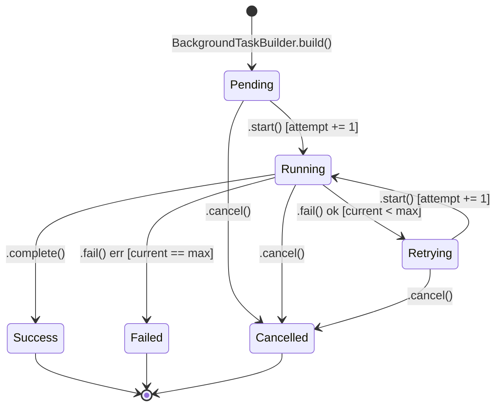

# Background Task Lifecycle

Compile-time state machine for background tasks, built with the typestate pattern. Lifecycle state lives in the type
parameter (`BackgroundTask<State>`), so invalid transitions — e.g. calling `.complete()` on a `Pending` task — are
rejected by the compiler, not discovered at runtime.

## State machine



| State       | Struct           | Data                          | Notes                                                          |
|:------------|:-----------------|:------------------------------|:---------------------------------------------------------------|
| `Pending`   | unit struct      | —                             | Initial state after `build()`.                                 |
| `Running`   | unit struct      | —                             | `.start()` increments `current_attempt`.                       |
| `Retrying`  | `{ last_error }` | error from the failed attempt | Reachable only via `.fail()` when attempts remain.             |
| `Success`   | `{ output }`     | final payload                 | Terminal.                                                      |
| `Failed`    | `{ error }`      | error from last attempt       | Terminal — reached once `current_attempt == max_attempts`.     |
| `Cancelled` | unit struct      | —                             | Terminal — reachable from `Pending`, `Running`, or `Retrying`. |

`Success`, `Failed`, `Cancelled` expose no transition methods; a terminal task cannot re-enter the machine through this
API.

## Accessors (all states)

```rust,ignore
fn id(&self) -> &UniqueIdentifier;
fn name(&self) -> &BackgroundTaskName;
fn max_attempts(&self) -> u32;
fn current_attempt(&self) -> u32;
```

State-specific accessors: `BackgroundTask<Retrying>::last_error()`, `BackgroundTask<Success>::output()`, `BackgroundTask<Failed>::error()`.

## Construction

`BackgroundTaskBuilder` is the only way to obtain a `BackgroundTask<Pending>`.
`max_attempts` defaults to `1` if unset; a built task always starts with
`current_attempt() == 0`.

```rust,ignore
use valqeron_core::background_tasks::{BackgroundTask, BackgroundTaskBuilder, BackgroundTaskName, Pending};
use valqeron_common::UniqueIdentifier;

fn create_task() -> Result<BackgroundTask<Pending>, Box<dyn std::error::Error>> {
  let task: BackgroundTask<Pending> = BackgroundTaskBuilder::new()
          .id(UniqueIdentifier::new())
          .name(BackgroundTaskName::new("sync_data")?)
          .max_attempts(3)
          .build()?;

  Ok(task)
}
```

## Success path

Each transition consumes `self` and returns a new `BackgroundTask<State>`; the old value can no longer be used.

```rust,ignore
let task: BackgroundTask<Running> = task.start();          // Pending -> Running
let task: BackgroundTask<Success> = task.complete("output"); // Running -> Success
assert_eq!(task.output(), "output");
```

## Retry / failure path

`.fail()` returns `Ok(BackgroundTask<Retrying>)` while `current_attempt < max_attempts`, and
`Err(BackgroundTask<Failed>)` once attempts are exhausted.

```rust,ignore
let task = task.start(); // attempt 1

let task = match task.fail("connection lost") {
    Ok(retrying) => retrying.start(), // schedule next attempt -> attempt 2
    Err(failed) => return Err(failed.error().to_string()),
};

// attempt 2
match task.fail("connection lost again") {
    Ok(_) => unreachable!("max_attempts was 2"),
    Err(failed) => assert_eq!(failed.error(), "connection lost again"),
}
```

## Cancellation

`.cancel()` is available on `Pending`, `Running`, and `Retrying`, and always yields
`BackgroundTask<Cancelled>`.

## Terminal outcomes (`TaskOutcome`)

`TaskOutcome` unifies the three terminal typestates (`Success`, `Failed`, `Cancelled`) into a single enum:

```rust,ignore
pub enum TaskOutcome {
    Success(BackgroundTask<Success>),
    Failed(BackgroundTask<Failed>),
    Cancelled(BackgroundTask<Cancelled>),
}
```

Helper methods on `TaskOutcome`:

- `id(&self) -> &UniqueIdentifier` — returns the task ID regardless of outcome.
- `is_success(&self) -> bool` — `true` if `TaskOutcome::Success`.
- `is_failed(&self) -> bool` — `true` if `TaskOutcome::Failed`.
- `is_cancelled(&self) -> bool` — `true` if `TaskOutcome::Cancelled`.

## Task status (`TaskStatus`)

`TaskStatus` is a data-less enum mirroring lifecycle states, useful for status tracking and observability:

```rust,ignore
pub enum TaskStatus {
    Pending,
    Running,
    Retrying,
    Success,
    Failed,
    Cancelled,
}
```

`TaskStatus` implements `Display`, formatting as lowercase state names (`"pending"`, `"running"`, `"retrying"`, `"success"`, `"failed"`, `"cancelled"`).

## Errors

`BackgroundTaskName::new`:

- `Empty` — value is empty after trimming whitespace.
- `TooLong { max: 100 }` — more than 100 Unicode scalar values after trimming.

`BackgroundTaskBuilder::build`:

- `ZeroMaxAttempts` — `max_attempts` was set to `0`.
- `MissingId` — `.id(..)` was never called.
- `MissingName` — `.name(..)` was never called.

## Invariants

- `max_attempts >= 1`.
- `current_attempt` starts at `0`; each `.start()` call increments it, so the first execution is attempt `1`.
- Terminal states (`Success`, `Failed`, `Cancelled`) cannot transition further.
