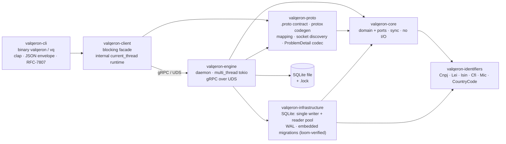
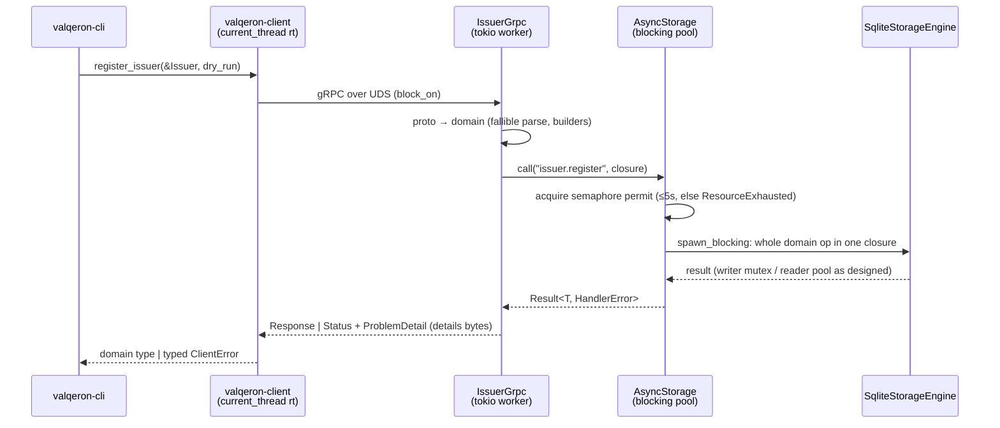

# Valqeron Engine — Architecture

Status: **implemented**. This describes the system as built, not a plan.

`valqeron-engine` is a user-bounded daemon that **owns the SQLite database exclusively** and serves it to clients over
gRPC on a Unix domain socket. The CLI (`valqeron`/`vq`) is a pure client: it contains no database code and cannot
function without a running engine.

## Crate graph



| Crate                     | Role                                                                                                                                                                                                        | Async?                               |
|---------------------------|-------------------------------------------------------------------------------------------------------------------------------------------------------------------------------------------------------------|--------------------------------------|
| `valqeron-core`           | Aggregates (`Issuer`, `Security`, `Listing`, `Venue`) + blocking ports (`*Repository`, `StorageEngine`).                                                                                                    | no — enforced by `just deps-check`   |
| `valqeron-identifiers`    | Fully validated identifier types; invalid state unrepresentable.                                                                                                                                            | no                                   |
| `valqeron-infrastructure` | SQLite adapter: one writer behind a `Mutex`, `Condvar` reader pool, WAL, compile-time-embedded migrations. **Private to the engine** — no other crate may depend on it.                                     | no — enforced                        |
| `valqeron-proto`          | Single wire-contract source of truth: `.proto` files, generated tonic types (lint-quarantined), fallible domain⇄proto mapping, socket discovery, `ProblemDetailProto`⇄`tonic::Status` codec, `PROTOCOL_VERSION`. | types only, no runtime               |
| `valqeron-client`         | Blocking client: connect + handshake, typed errors, returns domain types. No clap, no stdout.                                                                                                               | hides a `current_thread` runtime     |
| `valqeron-cli`            | Thin client binary. Local pre-validation for UX; the engine is authoritative.                                                                                                                               | no async code; tokio only transitive |
| `valqeron-engine`         | This daemon.                                                                                                                                                                                                | `multi_thread` tokio at the edge     |

Dependency rules: `infrastructure` is reachable only from `engine`; `tokio`/`tonic` appear only in `proto` (types),
`client`, and `engine`. `core` and `infrastructure` stay sync — that is the invariant the whole design protects.

## Engine internals

```
main.rs ── clap dispatch: run | install | uninstall | status
├── config.rs     EngineConfig (db path, socket path, intervals, durability)
├── paths.rs      db/log resolution (flag > env > platform dir)
├── lockfile.rs   EngineLock: exclusive advisory flock on <db>.lock
├── storage.rs    AsyncStorage: the async→sync bridge
├── grpc/
│   ├── issuer.rs IssuerService: register/get/list/patch/delete (unary)
│   ├── admin.rs  AdminService: health (handshake), status
│   └── problem.rs error → (tonic::Code, RFC-7807 ProblemDetail)
├── runtime.rs    lifecycle: lock → open → serve → drain → checkpoint
├── logging.rs    stderr (info default) + JSON file; valqeron::audit stays on stderr
└── service/      launchd plist / systemd user unit (embedded templates)
```

### Request path



### The async→sync bridge (`storage.rs`)

The ports are blocking; tonic handlers are async. Calling the reader pool from a runtime worker risks parking every
worker on the pool's `Condvar` with none left to release a reader. The bridge removes the class of bug:

- `AsyncStorage` = `Arc<SqliteStorageEngine>` + `Semaphore(MAX_IN_FLIGHT_STORAGE)`.
- Every storage call is one closure on **tokio's blocking pool** (`spawn_blocking`); runtime workers never touch SQLite.
- `MAX_IN_FLIGHT_STORAGE = READER_POOL_SIZE + 1` (readers + the single writer). More would only queue on the pool's own
  `Condvar`; fewer would idle readers.
- Permit acquisition times out (5s) → typed `Overloaded` → gRPC `ResourceExhausted`. Closed semaphore → `ShuttingDown` →
  `Unavailable`. Backpressure is explicit, never an unbounded pile of blocked threads.
- One closure carries the **whole** domain operation (e.g. `register_issuer`'s check-then-insert), so multi-step
  services never interleave across executions.
- `spawn_blocking` closures are not cancellable: a dropped RPC lets its closure run to completion; the permit releases
  when it finishes.
- The loom-verified pool in `infrastructure` is used exactly as designed — untouched.

### Dry run

Every mutating RPC carries `dry_run: bool`. The handler wraps the same closure body in
`StorageEngine::dry_run` — a savepoint that always rolls back. One RPC = one dry-run scope; there are no multi-RPC
dry-run sessions. The CLI's `--dry-run` simply sets the flag.

### Lifecycle (`runtime.rs`)

Startup (strictly ordered): acquire exclusive flock on `<db>.lock` → ensure socket dir exists with `0700` → unlink any
stale socket (safe: we hold the lock, so no live engine serves on it)
→ open database (migrations run here; the engine is the sole migration runner) → build
`multi_thread` runtime → bind `UnixListener`, chmod socket `0600` → serve
`RpcIssuerService` + `RpcAdminService`.

Steady state: one `select!` loop over SIGTERM/SIGINT, unexpected server exit, a jittered (±10%) maintenance interval
(`PRAGMA optimize` + passive WAL checkpoint, routed through
`AsyncStorage`, skip-if-busy), and a heartbeat log line.

Shutdown (order matters — the final checkpoint must not race in-flight writes):

1. Signal → stop accepting, drain in-flight RPCs (tonic graceful shutdown, ≤10s; second signal forces exit 1).
2. `storage.close()` → new calls rejected; wait idle (≤10s).
3. Runtime `shutdown_timeout` (≤20s) — service-manager SIGKILL is the final backstop.
4. Unlink socket, reclaim the engine via `Arc::try_unwrap` → drop = `PRAGMA optimize` +
   `wal_checkpoint(TRUNCATE)`. The semaphore drain makes this deterministic.
5. Release the lock last, after the checkpoint proves the DB is quiesced.

Exit codes: `0` clean, `1` runtime/forced, `2` config, `3` already running (lock held),
`4` service-manager failure. launchd/systemd restart policies key off these.

## Wire contract (`valqeron-proto`)

- Package `valqeron.v1`; compiled by `protox` in `build.rs` (no system `protoc`). Generated code is quarantined behind a
  scoped `#[allow]` — the one documented exception to the workspace deny-lints.
- IDs = canonical UUIDv7 strings. Timestamps = RFC-3339 UTC strings; server-generated
  `created_at` is truncated to **milliseconds** (storage fidelity), so a register response is byte-identical to every
  later read.
- Optimistic concurrency: reads return `version`; `patch`/`delete` take `expected_version` and return `WriteOutcomeProto`
  (`Applied | VersionMismatch{expected,actual} | Missing`) in the **response** — a stale version is an outcome, not an
  error.
- Inbound mapping is a fallible parse routed through the domain builders; invalid wire data cannot become a domain
  value.
- `AdminService::Health` doubles as the version handshake: the client refuses to operate unless
  `protocol_version == PROTOCOL_VERSION` (currently `1`). Bump on any breaking `.proto` change.
- Socket discovery lives here because both sides must agree:
  flag > `VALQERON_SOCKET` > platform runtime dir (else `<data dir>/run/`) + `valqeron.sock`. UDS path limit ≈104 bytes
  applies to overrides.

## Error contract

Engine failures map to exactly one `(tonic::Code, ProblemDetail)` pair; the RFC-7807 document travels prost-encoded in
the `Status` details. The client decodes it and the CLI renders it verbatim — `status` doubles as the CLI exit code.
Slugs are a compatibility contract; renaming one is a breaking change.

| Slug (examples)                                                    | Status/exit | gRPC code           |
|--------------------------------------------------------------------|-------------|---------------------|
| `issuer/validation/*`, `identifier/*-invalid`, `issuer/invalid-id` | 65          | `InvalidArgument`   |
| `issuer/duplicate-cnpj`, `issuer/duplicate-lei`                    | 9           | `AlreadyExists`     |
| `storage/failed`                                                   | 80          | `Internal`          |
| `engine/overloaded`                                                | 75          | `ResourceExhausted` |
| `engine/unavailable`                                               | 69          | `Unavailable`       |
| `engine/not-running`, `engine/unreachable` (client-side, no RPC)   | 69          | —                   |
| `engine/version-mismatch` (client-side)                            | 78          | —                   |

## Client (`valqeron-client`)

Blocking by design: callers stay synchronous; a per-`Client` `current_thread` runtime drives tonic inside `block_on` (do
not call it from within another runtime). Connect: resolve socket → missing file is an immediate, matchable
`NotRunning` → bounded connect (2s default) over a UDS connector → `Health` handshake. Per-RPC timeout 30s default.
Mutations are **never** retried. Engine problems surface as `ClientError::Problem(EngineProblem)`; transport failures
classify into `NotRunning`/`Unreachable`/`Rpc`.

## Concurrency & sizing

| Knob                      | Value                            | Rationale                                                                                                |
|---------------------------|----------------------------------|----------------------------------------------------------------------------------------------------------|
| Reader pool               | 4                                | serves the gRPC read fan-out; writes serialize on the writer mutex regardless                            |
| Storage in-flight         | 5                                | readers + writer; semaphore-bounded                                                                      |
| Storage queue timeout     | 5s                               | fail fast at the queueing stage                                                                          |
| RPC drain / storage drain | 10s                              | graceful shutdown budget                                                                                 |
| Runtime shutdown          | 20s                              | stuck-job backstop before SIGKILL                                                                        |
| Engine runtime            | `multi_thread` (default workers) | parallel h2/protocol work in front of the pool; `current_thread` would be correct but serializes framing |

## Environment & files

| Var / file                                | Owner            | Meaning                                                                             |
|-------------------------------------------|------------------|-------------------------------------------------------------------------------------|
| `VALQERON_DB`                             | engine only      | database path (flag > env > `<data dir>/valqeron.db`)                               |
| `VALQERON_SOCKET`                         | engine + clients | UDS path; must resolve identically on both sides                                    |
| `VALQERON_ENGINE_LOG_FILE` / `_LOG_LEVEL` | engine           | JSON log file (`off` disables) / file level                                         |
| `VALQERON_LOG_FILE` / `_LOG_LEVEL`        | CLI              | same semantics, CLI's own file                                                      |
| `<db>.lock`                               | engine           | exclusive advisory flock = single-instance authority; PID inside is diagnostic only |
| `valqeron.sock`                           | engine           | unlinked on clean exit; stale files removed at startup under the lock               |

## Service management

`install`/`uninstall` render embedded templates (launchd LaunchAgent on macOS, systemd user unit on Linux) with
`{{PLACEHOLDER}}` substitution; explicit `--db-path`/`--socket` overrides are propagated into the unit environment, and
the systemd sandbox is punched through for the db, socket, and log directories. `status` probes the lock PID + service
registration and exits non-zero when stopped (liveness probe).

## Extending

- **New RPC on an existing entity:** extend the `.proto`, add mapping (+ round-trip/negative tests), implement the
  handler as one `AsyncStorage::call` closure, map errors in
  `grpc/problem.rs`, expose a typed client method. Additive fields keep `PROTOCOL_VERSION`.
- **New entity (venue/listing):** SQLite adapter in `infrastructure` (`mapping/model/queries/
  repository` layout), wire into `Repositories`, then the steps above.
- **Streaming/events (future):** add a server-streaming service in proto; emit change events at the `AsyncStorage`
  commit points; fan out via `tokio::sync::broadcast`.